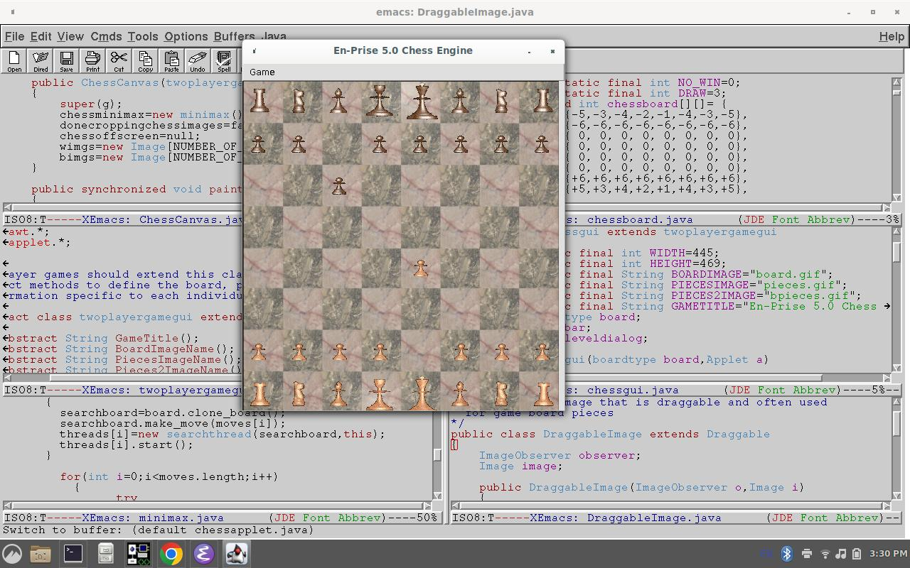
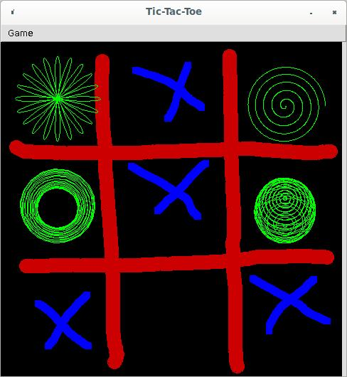
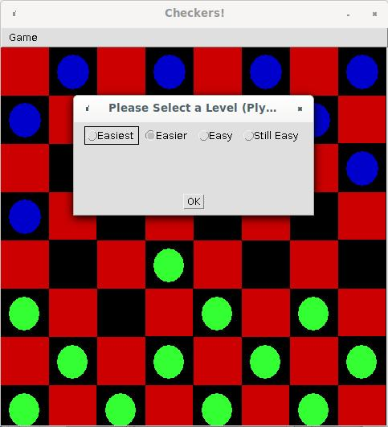

# chess
Java chess program by Mark Duane Brito (mark.brito@gmail.com) with GUI that demonstrates advanced Java AWT drag and drop graphics interfaces and the search algorithm is multi-threaded and performs better on systems that have many cores and processors. This java program also works as an applet, in text mode, or on most any platform (MacOS, Linux, Windows, Solaris, etc) and also runs as a Java applet in browsers.  The original design was to build a generic two player game framework where most of the logic of the games can be shared via base classes in an object oriented mannner, as there are base classes for the search algorithm, the drag and drop GUI, the board representation and other classes that abstract a two player game.  Chess, Checkers and TicTacToe were all implemented (no double jumping for checkers and checkmate functionality isn't implemented as of yet).  The chess program implements the minimax algorithm with alpha beta pruning and has a drag and drop graphical user interface. I implemented all of the code from scratch and even modeled the chess pieces myself.

Running the games:
From appletviewer:  
$ java sun.applet.AppletViewer https://distortedmirror.github.io/chess/chess.html 
 
As a downloaded application:
First clone the repository:
 
$ git clone https://github.com/distortedmirror/chess.git
 
then go to the directory and run the apps.
 
$ cd chess 
$ java chess  # for chess 
$ java tictactoe # for tictactoe 
$ java checkers # for checkers 
 
 
Thanks for checking it out!

-Mark Brito-

